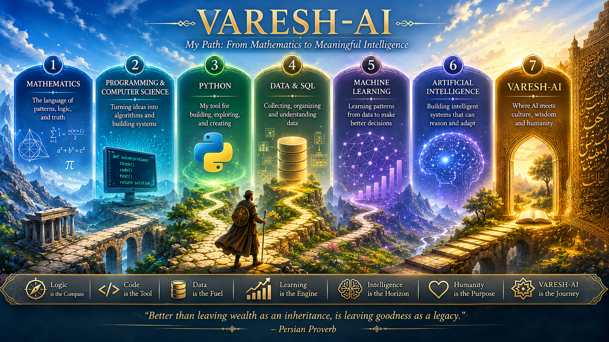

# VARESH-AI

## Wisdom, Agency & Reflective Ethical Intelligence

> A research and learning project exploring wisdom-centered artificial intelligence for human decision-making, reflection, and meaning.

  

---

## 🌱 Research Question

VARESH-AI explores a fundamental question:

**Can AI help humans make more thoughtful and responsible decisions without replacing human judgment?**

The project investigates how artificial intelligence might combine:

* Evidence
* Context
* Human values
* Ethical reasoning
* Reflection
* Wisdom traditions
* Modern AI techniques

to support better-informed human decisions.

VARESH-AI does **not** aim to make decisions on behalf of humans.

The long-term direction is to explore AI as a **reflective decision-support system** that helps people examine evidence, values, alternatives, consequences, and assumptions before making their own decisions.

---

## 🧠 Vision

VARESH-AI is inspired by a simple distinction:

**Intelligence is not necessarily wisdom.**

An intelligent system may be able to retrieve information, identify patterns, generate alternatives, or predict outcomes.

Wisdom-oriented intelligence asks additional questions:

* What does this information mean?
* What values are involved?
* What are the possible consequences?
* What assumptions are being made?
* What alternatives have been overlooked?
* What should a human consider before deciding?

The long-term vision is to explore an AI system that can support a process such as:

**Question → Context → Evidence → Values → Reflection → Alternatives → Consequences → Human Decision**

The final decision remains with the human.

---

## 🤝 Human Agency

A central principle of VARESH-AI is **human agency**.

The system should not be designed around the assumption that AI must produce the final answer.

Instead, the project explores whether AI can help humans:

1. Understand a problem more clearly.
2. Gather and organize relevant evidence.
3. Identify values and ethical considerations.
4. Generate alternative perspectives.
5. Examine possible consequences.
6. Reflect on assumptions and uncertainties.
7. Make a more informed decision.

The goal is **decision support, not decision replacement**.

---

## 📚 Rumi and Persian Wisdom

One of the foundational cultural and philosophical sources of this project is the work of:

**Mawlana Jalal al-Din Rumi**

and the broader tradition of Persian literature, philosophy, and wisdom.

VARESH-AI may explore concepts such as:

* Meaning
* Self-awareness
* Love
* Fear
* Patience
* Choice
* Responsibility
* Compassion
* Human nature

and investigate how such concepts might be represented, structured, retrieved, and studied computationally.

Rumi is **not** treated as an AI persona or chatbot.

Instead, his works are considered a source of cultural, literary, philosophical, and potentially structured knowledge for research.

Any computational interpretation of such material must remain aware of the difference between the original texts, their historical context, modern interpretations, and machine-generated representations.

---

## 🔬 Research Directions

VARESH-AI may gradually investigate several interconnected areas:

### Artificial Intelligence

* Natural Language Processing (NLP)
* Large Language Models (LLMs)
* Retrieval-Augmented Generation (RAG)
* Embeddings
* Knowledge Graphs
* Explainable AI (XAI)

### Decision Support

* Evidence analysis
* Value identification
* Alternative generation
* Reflection
* Uncertainty
* Explainability
* Human-in-the-loop systems

### Digital Humanities

* Persian literary texts
* Rumi and the Masnavi
* Semantic search
* Text representation
* Cultural knowledge structures
* Computational approaches to wisdom literature

The technologies are means to investigate the research questions, not the research questions themselves.

---

## 🗺️ Development Roadmap

### Phase 0 — Foundations

* Python
* Git
* GitHub
* Programming fundamentals
* Data structures
* Software development practices

### Phase 1 — Knowledge

* Persian texts
* Rumi and the Masnavi
* Text preprocessing
* Semantic search
* Embeddings
* Knowledge representation

### Phase 2 — Intelligence

* NLP
* RAG
* LLM integration
* Knowledge Graphs
* Reasoning experiments

### Phase 3 — Reflective Decision Support

* Evidence analysis
* Value identification
* Alternative generation
* Reflection
* Consequence analysis
* Explainability
* Human-in-the-loop decision support

### Phase 4 — Real-World Context

* Human interaction
* Cultural context
* Environmental context
* Decision-making experiments
* Evaluation

### Phase 5 — Research & Global Collaboration

* Systematic evaluation
* Documentation
* Open-source development
* Research publications
* Reproducible experiments
* International collaboration

---

## 🌊 Kish as a Future Research Context

The project is being developed in **Kish Island, Iran**.

Kish may eventually provide a useful real-world context for exploring how wisdom-centered AI could interact with:

* People
* Culture
* Tourism
* Environment
* Place
* Human experience
* Decision-making

At the current stage, Kish should be understood as a **potential future research context**, rather than as an established living laboratory.

The broader vision is global, while the project's initial development begins from a specific cultural and geographical context.

---

## 📈 Current Status

**Status: Early Research / Learning Prototype**

VARESH-AI is currently at an early stage of development.

The project is being developed progressively through:

* Learning
* Small experiments
* Software development
* Research exploration
* Documentation
* Critical evaluation

The initial implementations will intentionally remain simple.

The architecture, research questions, and experimental methods may evolve as evidence and experience accumulate.

---

## 🧪 Research Philosophy

VARESH-AI is intentionally experimental.

The project does not assume that wisdom can simply be converted into an algorithm, nor that an AI system can objectively determine what is wise.

Instead, it asks whether computational systems can help humans **structure reflection around evidence, values, alternatives, uncertainty, and consequences**.

Claims about novelty, scientific contribution, effectiveness, or ethical impact should be supported by:

* Research
* Experiments
* Evaluation
* Comparison with existing approaches
* Transparent documentation

---

## 🤝 How to Contribute

VARESH-AI is an open research and learning project.

Constructive contributions are welcome, including:

* Research ideas
* Technical suggestions
* Critical feedback
* Ethical concerns
* Literature recommendations
* Persian language and cultural expertise
* AI and software engineering expertise
* Experimental ideas

The project especially welcomes criticism that can help identify weak assumptions, methodological problems, or unsupported claims.

---

## 👨‍💻 Author

**Iraj Barani**

Information Technology Engineering

Kish International Campus
Amirkabir University of Technology

---

## 📜 Philosophy

> Intelligence may help us find an answer.
>
> Wisdom asks whether it is the right question.

---

## ⚠️ Important Note

VARESH-AI is an experimental research and learning project.

Its long-term vision is ambitious, but the project does not claim that its proposed ideas are novel, scientifically validated, or practically effective at this stage.

Such claims should emerge only through research, experimentation, evaluation, comparison with existing work, and evidence.

---

## 📄 License

License information will be added as the project develops.
